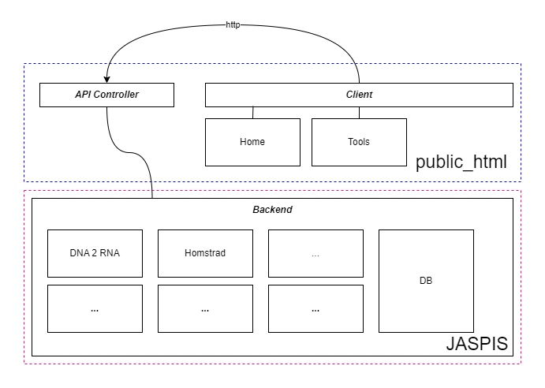

## Getting started

Follow these steps to set up and configure the environment for your specific needs:

1. **Environment Setup:**
   - It is highly recommended to create a new directory for every branch `mkdir ./<branchname>` `cd <branchname>`
   - Create a new local branch `git checkout -b webserver`
   - Or switch to webserver branch `git checkout webserver`
   - Pull this branch `git pull origin webserver`
   - (Optional: If no .env is set up, any input for the file handling script must be provided via command line parameters) Create an .env file in the root of the project  `nano .env` and add the following lines and adjust for your individual needs:
     
      ```python
      SERVER_CGI_DIR='/ABSOLUTE/PATH/TO/CGI/SERVERS/PUBLIC/DIR'
      PRODUCTION_FILES='/ABSOLUTE/PATH/TO/THIS/blockgruppe3/app'
      ```

2. **Push changes to the CGI server:**   
> [!IMPORTANT]
> The app directory represents a mirror of the public_html directory of the CGI server.
   - Save your local changes to the app directory
   - If you have set up an .env file, run `bash transfer.sh`
   - If you HAVEN'T set up an .env file, run `bash transfer.sh -d /ABSOLUTE/PATH/TO/CGI/SERVERS/PUBLIC/DIR -p /ABSOLUTE/PATH/TO/THIS/blockgruppe3/app`
   - The file handling script will synchronize the app directory with the public_html directory on the CGI server (including Additions/Updates/Removals)
   - Your updates should now be [live](http://bioclient1.bio.ifi.lmu.de/~hummelj/cgi-bin/home.py)

3. **Push chanes to version control:**
   - Only push your changes to remote version control after verifying that the updated webserver is functioning correctly, as testing pipelines are not currently in place
